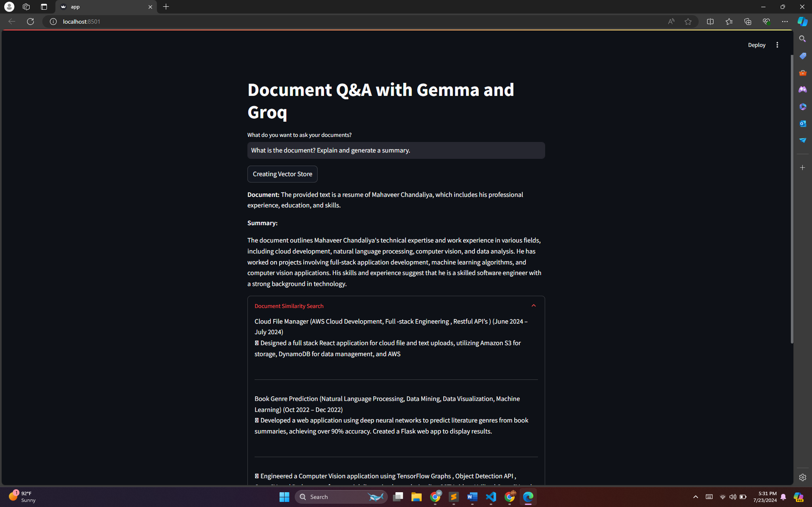
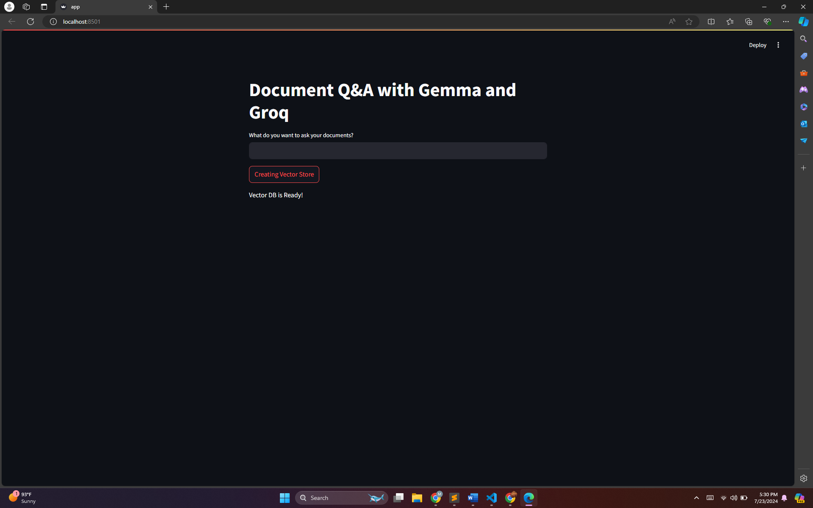

# Document Q/A with Google's Gemma model and Groq API Inference



This project implements a Document Q/A application using the Gemma model and Groq inference API with a Streamlit UI. The application allows users to upload documents, ask questions related to the document content, and receive answers powered by the Gemma model. Embeddings are created using GoogleGenerativeAIEmbedding models and inference models are ran using Groq. Groq has many other available models such as Llama3, Gemma2, Mistral and many more. Try as per your need.

## Features
- Ask questions related to the document content
- Get answers using the Gemma model via Groq inference API
- User-friendly interface with Streamlit

## Installation
1. **Clone the repository**
    ```bash
    git clone https://github.com/your-username/document-qa-streamlit.git
    cd document-qa-streamlit
    ```

2. **Create and activate a virtual environment**
    ```bash
    python3 -m venv venv
    source venv/bin/activate
    ```

3. **Install the dependencies**
    ```bash
    pip install -r requirements.txt
    ```

## Configuration
Create a `.env` file in the root directory of the project and add your Groq API key and Google API key:
```
GROQ_API_KEY=your_groq_api_key
GOOGLE_API_KEY=your_google_api_key
```

## Usage
Run the Streamlit application:
```bash
streamlit run app.py
```



## Contributing
Contributions are welcome! Please fork this repository and submit pull requests.
